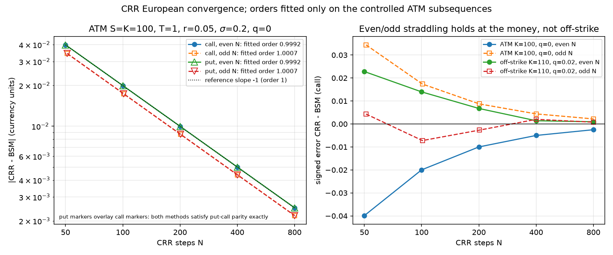
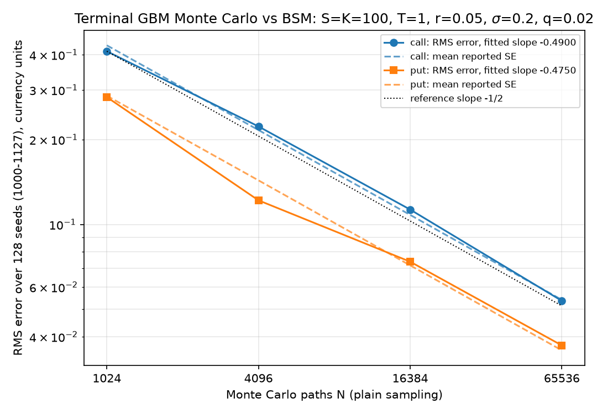
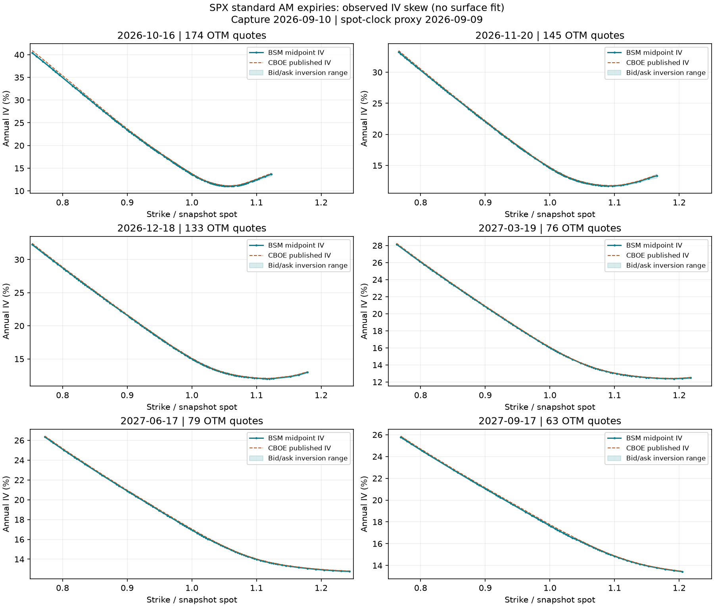
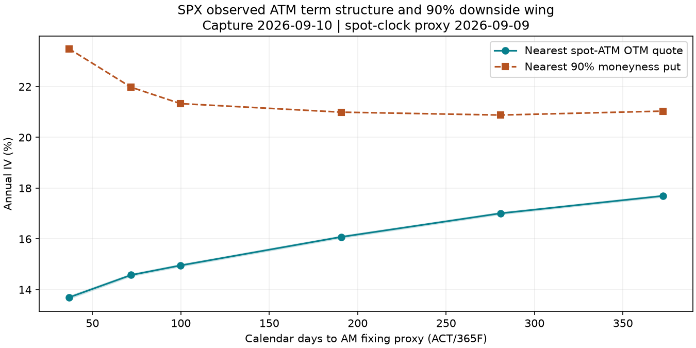

# crossprice — Results

Three independent pricing methods for European, American and discrete Asian options — the
Black–Scholes–Merton (BSM) closed form, a Cox–Ross–Rubinstein (CRR) binomial tree and risk-neutral
Monte Carlo — are made to price the same contracts, and a harness records where they agree, where they
cannot, and why. A safeguarded implied-volatility solver inverts the closed form, and one dated SPX
option-chain snapshot is cleaned, inverted and audited to show how far a single volatility is from
describing real quotes. This is a pricing and numerical-methods project. It contains no trading logic,
no strategy and no performance claim about markets.

Every number in this document traces to a committed artifact or a named test; [§7](#7-provenance)
gives the map. The artifacts regenerate byte-for-byte from the committed code, offline, with two commands:

```bash
uv sync --group dev
uv run python -m crossprice.crossvalidate --out docs                              # §1–§3: 7 artifacts
uv run python -m crossprice.surface --snapshot data/SPX_20260910.csv --out docs   # §5: 8 artifacts
```

Contents: [1. Agreement table](#1-the-agreement-table) · [2. Convergence](#2-convergence) ·
[3. Where the methods disagree, and why](#3-where-the-methods-disagree-and-why) ·
[4. Implied volatility](#4-implied-volatility-the-inverse-problem) · [5. The observed SPX smile](#5-the-observed-spx-smile) ·
[6. Limitations](#6-limitations) · [7. Provenance](#7-provenance) · [8. Left out, and why](#8-left-out-and-why)

---

## 1. The agreement table

The block below is `docs/agreement_table.md` as generated (the stress-case section of that file is
omitted here; it is discussed in §3).

> Rows: 363 — pass 291, expected 67, degenerate 5, FAIL 0.
>
> `pass`: agreement under the criterion below. `expected`: a declared rejection, degeneracy or
> unsupported instrument/method pair occurred as declared. `degenerate`: an undeclared Monte Carlo
> sample with no usable variation (no payoff observed, or a control variate exact on every path), logged
> with its mechanism and not counted as agreement. `FAIL`: anything else, including a declared failure
> that did not occur.
>
> Criteria fixed before pricing: deterministic rows `|error| <= 0.005 + 0.002*|reference|` at 1000 tree
> steps (exact rows `1e-10 + 1e-12*|reference|`); stochastic rows `|z| <= 4.04` from a two-sided
> family-wise false-alarm budget of 0.01 over 187 declared stochastic rows; Monte Carlo uses 65536 paths
> (+4096 independent pilot paths when a control variate is fitted).
>
> | instrument | method | criteria | rows | pass | expected | degenerate | FAIL | max_abs_error | max_abs_rel_error | max_abs_z | covered_95 |
> |---|---|---|---|---|---|---|---|---|---|---|---|
> | european | crr | exact/tolerance | 89 | 88 | 1 | 0 | 0 | 0.015 | 0.8 | — | n/a |
> | european | mc_plain | exact/z_score | 88 | 86 | 1 | 1 | 0 | 0.22 | 5.67 | 2.39 | 80/83 |
> | european | mc_antithetic_control | exact/z_score | 87 | 80 | 3 | 4 | 0 | 0.0246 | 1 | 3.07 | 72/77 |
> | american | bsm | n/a | 25 | 0 | 25 | 0 | 0 | — | — | — | n/a |
> | american | crr_american | tolerance | 25 | 25 | 0 | 0 | 0 | 0.00169 | 0.00175 | — | n/a |
> | american | mc_plain | n/a | 25 | 0 | 25 | 0 | 0 | — | — | — | n/a |
> | asian | bsm | n/a | 6 | 0 | 6 | 0 | 0 | — | — | — | n/a |
> | asian | crr | n/a | 6 | 0 | 6 | 0 | 0 | — | — | — | n/a |
> | asian | asian_mc_geometric | z_score | 6 | 6 | 0 | 0 | 0 | 0.0337 | 0.0087 | 1.45 | 6/6 |
> | asian | asian_mc_arithmetic_control | lower_bound/upper_bound | 6 | 6 | 0 | 0 | 0 | — | — | — | n/a |
>
> 95% intervals covering the reference: 158/166; the Binomial(166, 0.95) 99% band is [150, 164]
> (inside). z-scores: mean -0.087, SD 0.961, max |z| 3.07.

**What is compared with what.** European rows are judged against the BSM closed form, which is exact
for this model; the tree never calls BSM and the simulation samples the terminal law directly, so
their agreement is evidence. American rows are judged against a 6400-step tree of the *same*
implementation — a resolution self-consistency check, labelled as such in the `reference` column, not
an independent benchmark. Geometric Asian Monte Carlo is judged by z-score against its exact discrete
closed form. Arithmetic Asian rows have no closed form; the geometric price is used only as the AM–GM
bound (a lower bound for calls, an upper bound for puts), never as the arithmetic price.

**The grid.** 72 European contracts (S = 100; K ∈ {80, 100, 120}; T ∈ {0.25, 1, 2}; σ ∈ {0.10, 0.30};
(r, q) ∈ {(0.05, 0), (0.01, 0.03)}; call and put) × three methods; 24 American contracts (σ = 0.2;
T ∈ {0.25, 1}; (r, q) ∈ {(0.05, 0), (0.02, 0.05)}); 6 discrete Asians with 12 monitoring dates; and
17 named stress cases (expiry, one day to expiry, zero and very low volatility, deep ITM/OTM, negative
rate, negative carry, negative dividend, a five-year σ = 1 call, a coarse tree that must reject its
probability, a Monte Carlo sample declared to see no payoff, and an American call at a negative rate).

**How the criteria were set.** The deterministic tolerance is the tree's committed 1000-step grid
tolerance. The stochastic threshold is not 1.96: with 187 declared stochastic rows, requiring every
95% interval to cover would flag a correct estimator about nine times. Instead each row is tested at
`z_crit = Φ⁻¹(1 − 0.01/(2·187)) = 4.04`, holding the probability that *any* correct row is flagged at
1%, and the family is checked separately: the count of covering 95% intervals must lie in the
Binomial(166, 0.95) 99% band. 158 does. The z-scores have mean −0.087 and SD 0.961, which is what a
calibrated standard error looks like across a heterogeneous grid. Three of the 71 scored plain-MC grid
rows have |z| > 1.96; about 3.5 would be expected.

**Outcomes behind the statuses.** `docs/crossvalidation_run.json` records 291 `agree`, 62
`unsupported` (BSM and plain Monte Carlo for American rows; BSM and the tree for Asian rows), 9
`degenerate` (4 declared, 5 not) and 1 `error` (the declared tree rejection). The 67 `expected` rows
are those 62 unsupported pairs plus the five declared events.

**Mutation checks.** The harness was tested against deliberately broken pricers on the quick
configuration: a tree scaled by 1.01, a Monte Carlo estimator with a +0.5 bias, an arithmetic Asian
shifted by −1, and a tree that clips its probability into (0, 1) instead of raising. All four produce
`FAIL` rows (`tests/test_crossvalidate.py`: `test_corrupted_tree_is_detected`,
`test_biased_monte_carlo_is_detected`, `test_violated_asian_bound_is_detected`,
`test_clipping_instead_of_raising_breaks_the_declared_expectation`).

## 2. Convergence



**Tree.** At the money (S = K = 100, T = 1, r = 0.05, σ = 0.2, q = 0), the absolute error against BSM
is fitted separately on even step counts N ∈ {50, 100, 200, 400, 800} and odd counts N + 1. Fitted
orders: **0.999169 (even)** and **1.000651 (odd)**, identical for the call and the put because both
obey parity. Even trees place a node on the strike and undershoot; odd trees straddle it and overshoot.
The right panel repeats the experiment off the strike (K = 110, q = 0.02): the 50- and 51-step errors
are both positive (+0.022818, +0.004330) and the 101-step error is negative (−0.007220). The
even-under/odd-over rule is a property of at-the-money node alignment, not of CRR in general; two
arbitrary resolutions should never be used to extrapolate. Data: `docs/figures/crr_convergence.csv`.



**Simulation.** RMS error over 128 independent seeds (1000–1127) at N = 1024, 4096, 16384, 65536
plain paths (S = K = 100, T = 1, r = 0.05, σ = 0.2, q = 0.02). Fitted log–log slopes: **−0.490007
(call)** and **−0.474954 (put)** against the theoretical −1/2. The dashed lines are the mean reported
standard error at each N; a calibrated SE should track the RMS error, and it does:

| N | call RMS error | call mean SE | put RMS error | put mean SE |
|---:|---:|---:|---:|---:|
| 1024 | 0.411478 | 0.431877 | 0.282957 | 0.286164 |
| 4096 | 0.222687 | 0.216185 | 0.121787 | 0.143367 |
| 16384 | 0.112956 | 0.108129 | 0.073792 | 0.071607 |
| 65536 | 0.053608 | 0.054038 | 0.037246 | 0.035781 |

The ratio of mean SE to RMS error lies in [0.95, 1.18] throughout. The mean signed error is at most
0.015 in magnitude at 1024 paths and 0.004 at 65536. Data: `docs/figures/mc_convergence.csv`.

Both experiments are also asserted as tests, not only plotted
(`test_crr_convergence_reproduces_committed_experiment`,
`test_mc_convergence_reproduces_committed_experiment`; the underlying rate tests are
`tests/test_binomial.py::test_atm_convergence_order_and_oscillation` and
`tests/test_montecarlo.py::test_rms_error_converges_as_inverse_square_root`).

## 3. Where the methods disagree, and why

Each region below has a committed row, test or figure behind it. Numerical error, inverse
conditioning, quote quality and model assumptions are different sources of disagreement and are kept
apart.

### 3.1 Tiny prices: the tolerance is right and the relative error is still large

Both numerical methods have errors set by the *scale* of the contract (S, K, σ√T), not by its price.
The K = 80, T = 0.25, σ = 0.1 puts have BSM prices 1.065447×10⁻⁶ (r = 0.05, q = 0) and
5.989556×10⁻⁶ (r = 0.01, q = 0.03). The 1000-step tree is off by −3.28×10⁻⁸ and −1.93×10⁻⁷ —
relative errors of −3.1% and −3.2%, fifteen times `rtol`, while the absolute errors sit five orders of
magnitude inside `atol`. Plain Monte Carlo on the second put returns 4.0×10⁻⁵ with SE 4.0×10⁻⁵:
relative error +567%, z = 0.85, fully consistent with its own uncertainty. The stress rows show the
same effect one day from expiry (K = 103 call, price 7.80×10⁻⁴: tree −0.48%, plain MC +2.0%) and deep
out of the money (K = 200 call, 3.26×10⁻³: tree −1.4%, plain MC −31.5% at z = −1.55; K = 50 put,
4.99×10⁻⁴: tree −1.3%, plain MC +32.5% at z = 0.80). The harness reports both error measures and
annotates rows that pass on the absolute term alone; it does not tighten or loosen anything.

### 3.2 Rare payoffs: the normal interval is built from too few events

Deep out of the money, a few dozen of 65536 paths pay anything; the sample mean and SE are estimated
from that handful, the SE is itself noisy, and the interval is only roughly normal. The rows above
passed with |z| ≤ 1.55, but their ±30% relative errors show the resolution. Further out no path pays
at all and the estimator reports 0 ± 0.

### 3.3 No payoff observed: a zero SE that means blind

Three undeclared grid rows — the two tiny puts of §3.1 (plain and controlled at r = 0.05; controlled at
r = 0.01) — and the declared stress row (K = 1000 call, 1000 paths, reference 3.06×10⁻³⁰) saw no
positive payoff. Each returns price 0, SE 0 and a zero-width interval that excludes the truth. The
library flags the result `degenerate`; the harness refuses to compute z and records the mechanism. A
reader who saw only "0.000000 ± 0" would be misled, and the status column exists for exactly this.
For the r = 0.05 put the per-path probability of finishing below 80 is about 1.4×10⁻⁶, so roughly 0.1
hits were expected in the whole sample; nothing is wrong with the code.

### 3.4 A perfect control variate is also degenerate

On the K = 80, T = 0.25, σ = 0.1 *calls*, every one of 65536 sampled paths finishes in the money, so
the discounted payoff is exactly X − Ke⁻ʳᵀ with X the discounted terminal price — the control variate
itself. The fitted coefficient is one, every corrected observation is the same number, and the SE
collapses to roundoff (3.0×10⁻¹⁷ and 3.3×10⁻¹⁷). The estimate is the forward-intrinsic value and its
error — **−1.065447×10⁻⁶ and −5.989556×10⁻⁶ — is exactly minus the corresponding put price**, by
put–call parity: the value of the unsampled region where the payoff is not linear in the control. A
z-score here would be ~10⁸ and meaningless; the recorded variance-reduction factor (a ratio to a
roundoff SE) is equally meaningless and the row says so. The library's own degenerate flag requires
literally identical observations and does not fire; the harness adds a resolution floor
(SE ≤ 10⁻¹² × price scale is degenerate, not scored). The same mechanism produces the three declared
degeneracies in the stress set (deep-ITM call K = 20: error 0; deep-ITM put K = 300: −4.7×10⁻⁷;
the low-volatility forward-ITM call: −1.0×10⁻⁷). A control variate that explains *all* the sampled
variance has also removed the estimator's ability to see anything the sample did not contain.

### 3.5 The tree's admissibility boundary: reject, do not clip

CRR needs |r − q|Δt < σ√Δt, i.e. N > T(r − q)²/σ². At σ = 0.02, r = 0.10, T = 1 that is N > 25; the
16-step tree raises `ValueError: CRR probability requires abs(rate-div)*dt < vol*sqrt(dt); increase
steps` and the row records the exception as the declared `expected` error. The 1000-step tree on the
same contract is off by −1.71×10⁻⁸. Clipping the probability into (0, 1) would price a different
model; the mutation test shows such a tree is caught because the declared error fails to occur.

### 3.6 The tree's oscillation depends on node–strike alignment

§2: the leading error term flips sign with the strike's position among the terminal nodes. At the
money the even/odd rule is clean; off the strike the alignment drifts with N and both 50- and 51-step
errors are positive. The largest tree error on the whole table is −0.014960 on the five-year σ = 1
call (reference 76.823, relative −1.9×10⁻⁴); the largest on the grid is −0.004097 on the K = 100,
T = 2, σ = 0.3 pair (relative −3.5×10⁻⁴ for the put), one seventh of the allowed band.

### 3.7 Variance reduction that does not pay

Across the 68 scored controlled European grid rows the *measured* equal-cost variance-reduction factor
(antithetic pairs plus a control variate fitted on 4096 independent pilot paths, charged against a
plain estimator of equal total cost) has median 26.2, tenth percentile 4.5 and ninetieth percentile
375 — and is **below one** for the two deep-OTM short-dated calls (K = 120, T = 0.25, σ = 0.1: 0.884
and 0.941). There the payoff is rare, its correlation with the terminal price is weak, and the pilot
paths are cost with no return. The same technique gives factors of 472–2168 on the Asian rows.

### 3.8 Where "agreement" means less than it sounds

American rows compare the tree with itself at higher resolution; the largest 1000-vs-6400-step
difference is 1.69×10⁻³ (ATM call, r = 0.05, q = 0, where the American value equals the European one and
the difference is pure tree resolution). A shared error in the exercise logic would not show. The
negative-rate American call stress row (S = 120, K = 100, T = 1, r = −0.05, σ = 0.2, q = 0) prices
20.270976 against the 6400-step 20.270758, while the European closed form for the same inputs,
`bsm_price(120, 100, 1, -0.05, 0.2)`, is 18.286870: with r < 0 the non-dividend American call is
*not* equal to the European one (`tests/test_binomial.py::test_nondividend_call_equality_requires_nonnegative_rates`),
and BSM is correctly marked unsupported rather than used as a reference. Arithmetic Asian rows check an
inequality: calls exceed the geometric price by 0.126–0.257 and puts fall short by 0.067–0.197, with
SEs of 5×10⁻⁴–10⁻³, so the AM–GM ordering holds by hundreds of standard errors — but a bias that
preserved the ordering would pass. Both row types are labelled in the `reference` column.

### 3.9 Accurate inversion does not repair an uncertain quote

The implied-volatility solver (§4) recovers the tiny-put volatilities of §3.1 from their exact prices
to −9.4×10⁻¹⁶ and −2.6×10⁻¹⁴. Adding 10⁻⁶ to those prices moves the recovered volatility by
0.00274955 and 0.00071535 (0.275 and 0.072 volatility points): the vegas are 2.66×10⁻⁴ and
1.31×10⁻³ per unit volatility, so price uncertainty at the 10⁻⁶ level leaves volatility poorly
determined. A near-expiry deep-ITM price can round to intrinsic and lose the volatility entirely (the
one-day K = 20 call at σ = 0.1 rounds to exactly 80 and reports `lower_bound`). Brent rescues unsafe
Newton steps; no root solver can rescue a parameter the input does not identify. In the SPX snapshot
(§5) the same distinction appears as endpoints: of 1051 quotes reaching inversion, 17 bid and 4 ask
endpoints fail while the midpoint of 1038 inverts.

### 3.10 Correct numerics do not make a constant-volatility cross-section fit

The three methods agree within their criteria on *model inputs*. On the SPX snapshot the same BSM
formula needs a different volatility at every strike: near 90% moneyness versus at the money the
difference is 9.80 volatility points for the October expiry and 3.34 for September 2027 (§5). Each
successful inversion reprices its quote to better than 10⁻¹⁰ index points, so this is not solver
error; the single-volatility restriction cannot reproduce the retained midpoints under the chosen
inputs. Tighter tolerances or more paths address numerical error, not this.

## 4. Implied volatility: the inverse problem

`crossprice.implied_vol.implied_vol(spot, strike, tau, rate, price, div=0.0, kind="call")` inverts the
BSM price for volatility with safeguarded Newton on the analytic vega, bracketed at every step, and a
SciPy Brent fallback. Its frozen result carries the root, the iteration count, which method finished,
the repriced residual and an explicit status. Prices outside the no-arbitrage bounds raise; the lower
bound reports `vol = 0` and `lower_bound`; the upper bound and expiry report that no finite volatility
is identified. Convergence requires both |residual| ≤ 10⁻¹⁰ currency units and a volatility step
≤ 10⁻¹²; a shared budget of 128 iterations (at most 12 of them Newton) and a volatility cap of 16
bound the search, and exhaustion or an oversized final residual is recorded as such, never relabelled
convergence.

**Round trip** (`tests/test_implied_vol.py::test_seeded_roundtrip`, seed 20260910, tolerance 5×10⁻¹⁰
fixed before running): 256 contracts per kind with signed rates and dividends and log-forward
moneyness within two total standard deviations. Maximum recovered-volatility error **9.94205×10⁻¹³
(calls)** and **9.94316×10⁻¹³ (puts)**; medians 5.97×10⁻¹⁶ and 4.44×10⁻¹⁶; 95th percentiles
5.25×10⁻¹³ and 5.30×10⁻¹³. Per kind, 246 rows finished by Newton and 10 by Brent; the maximum
iteration count was 8. The controlled-moneyness construction is part of this claim; it is not a
guarantee over arbitrary float64 prices.

**Safeguards exercised.** A forced zero-vega Newton failure is rescued by Brent in 10 iterations;
Brent alone takes 13 (`test_brent_rescues_zero_vega_or_disabled_newton`). Initial guesses of 0.02,
0.2, 2 and 20 reach the same root in 10, 6, 6 and 16 iterations
(`test_initial_guess_changes_work_not_root`). The one-day K = 103 call (price 0.000766796145185)
recovers 0.20000000000000473 in 11 Newton evaluations (`test_one_day_otm_and_rounded_intrinsic_limit`).

**Conditioning** (`test_harness_tiny_time_value_conditioning`), S = 100, K = 80, T = 0.25, σ = 0.1:

| quantity | r = 0.05, q = 0 | r = 0.01, q = 0.03 |
|---|---:|---:|
| put price | 1.06544702839×10⁻⁶ | 5.98955599606×10⁻⁶ |
| vega per unit volatility | 2.66369408559×10⁻⁴ | 1.30556210463×10⁻³ |
| recovered put volatility error | −9.44×10⁻¹⁶ | −2.57×10⁻¹⁴ |
| recovered call volatility error (parity call) | +3.37×10⁻¹¹ | +3.29×10⁻¹² |
| volatility shift after +10⁻⁶ price | 0.00274955 | 0.00071535 |
| local 10⁻⁶ / vega prediction | 0.00375418 | 0.00076595 |

The calls have the same vega but lose more precision against their large intrinsic value. The region
is ill-conditioned, not devoid of a root. Round-trip agreement validates the inverse of this
library's forward code, not an independent model.

## 5. The observed SPX smile

### 5.1 What was captured, and when

One payload from CBOE's public delayed-quotes endpoint for the standard SPX root (European exercise,
AM settlement; SPXW PM contracts excluded so that fixing conventions are not mixed), retrieved
**2026-09-10 12:42:45 UTC, before the regular session**. The same payload carries spot **7636.3599**
with last update **2026-09-09 16:14:59 Eastern**, 16.46 hours before retrieval; the raw payload clock
reads `2026-09-10 12:42:18` without a timezone. Quote update times are not provided. **These are not
synchronized intraday data.** Valuation uses the spot timestamp as an explicit proxy clock; the
consequences are quantified in §5.3 and §6.

3946 of the payload's 29230 quotes belong to the six selected standard monthly expiries nearest 1, 2,
3, 6, 9 and 12 months: 2026-10-16, 2026-11-20, 2026-12-18, 2027-03-19, 2027-06-17, 2027-09-17
(dates from the source symbols, not a hard-coded calendar). Expiry time is 09:30 America/New_York
with DST, ACT/365F; component opening times and the cash-payment lag are omitted. The snapshot,
its sidecar (`data/SPX_20260910.json`: source URLs, timestamps, full-payload SHA-256 hashes,
conventions) and the Treasury curve are committed; `scripts/fetch_chain.py` is the one-time
acquisition script and is never run by tests or by reproduction.

### 5.2 Model inputs

*Rate.* The latest US Treasury daily par-yield curve at or before the snapshot (**2026-09-09**,
`data/SPX_20260910_treasury.csv`), linearly interpolated to each expiry and converted by
2·log1p(y/2) to continuous compounding. This is a **zero-rate proxy, not a bootstrapped discount
curve**, and it does not extrapolate below the one-month tenor.

*Carry.* For each expiry the forward F and an effective continuous yield q are inferred from the
nearest spot-ATM call/put pair by put–call parity, with bid/ask forward endpoints recorded
(`docs/surface_carry.csv`). Effective (r, q) in percent by expiry: (3.799, 2.376), (3.899, 1.518),
(3.942, 1.314), (3.977, 0.689), (4.055, 0.548), (4.133, 0.510).

The decline of q with maturity is the signature expected when the recorded spot differs from the
level the option quotes were made against: a spot offset δ enters the inferred yield as −δ/T. Taking
the one-year value 0.51% as the reference, the three shortest expiries are consistent with an
option-implied spot about 0.19–0.22% (14–17 index points) below the recorded 7636.36 print; the six-
and nine-month values (−0.09%, −0.03%) do not fit a single offset, so dividend seasonality and
genuine term differences also contribute. Either way, **`div` in the artifacts is an effective carry
parameter that absorbs any spot/quote clock mismatch; it is not a dividend estimate or forecast.**
An external trailing cash dividend yield (Multpl, 1.06% as of 2026-09-09, estimated from S&P dividends
through June 2026) is used only as a sensitivity scenario.

### 5.3 Cleaning and inversion accounting

Every input row is retained with its first rejection reason (`docs/surface_quotes.csv`):

| stage | count |
|---|---:|
| input rows | 3946 |
| dropped: zero volume | 2454 |
| dropped: non-positive bid | 67 |
| dropped: relative spread > 50% | 15 |
| dropped: midpoint shape screen (convexity) | 359 |
| reached inversion | 1051 |
| inversion failed (price outside no-arbitrage bounds) | 13 |
| **inverted** | **1038** |

The shape screen checks, per expiry and kind on the actual unequal strike grid, midpoint monotonicity,
vertical-spread bounds and convexity with a 10⁻⁸ roundoff tolerance; at the first violation it removes
the involved quote with the widest relative spread (lexicographically last symbol on ties) and
re-checks. It is a conservative **greedy midpoint screen**: it does not prove that no bid/ask-feasible
price exists, does not find a maximal clean subset, and may bias the retained sample. Other rules
(sizes, open interest, crossed quotes, duplicates, non-SPX roots, < 7 days) are tested on a synthetic
dirty chain but were not the first rejection reason for any row here.

All 1038 successful inversions finished by Newton (at most 10 iterations); the maximum repricing
residual is **9.944756×10⁻¹¹ index points**. The 13 failures are all deep in the money — 11 calls
with K/S between 0.03 and 0.52 and 2 puts with K/S 1.39–1.44 — whose midpoints lie below the
discounted forward-intrinsic bound under the inferred forward and rate; their bids fail the same test
in all 13 cases and their asks in 4. Among all 1051 attempted quotes, 17 bid endpoints and 4 ask
endpoints fail while 1038 midpoints succeed (4 of the bid failures belong to quotes whose midpoint
inverted). Endpoint and midpoint outcomes are recorded separately, and bid/ask IV ranges are quote
ranges, not confidence intervals. 233 retained inversions are in the money; the figures plot the
**670 out-of-the-money quotes** (puts with K ≤ F, calls with K > F, 0.75 ≤ K/S ≤ 1.25), and the full
audit keeps the rest.

### 5.4 How far one volatility is from fitting





Nearest observed quotes, not fitted or extrapolated values (ATM within 1% of K/S = 1; wing within 3%
of K/S = 0.9; exact symbols and moneyness in `docs/figures/iv_term_structure.csv`). IV in percent,
the last column in volatility percentage points:

| expiry | plotted OTM quotes | ATM IV | IV near 90% moneyness | wing − ATM |
|---|---:|---:|---:|---:|
| 2026-10-16 | 174 | 13.693711 | 23.491331 | 9.797620 |
| 2026-11-20 | 145 | 14.575591 | 21.977500 | 7.401909 |
| 2026-12-18 | 133 | 14.954366 | 21.329248 | 6.374881 |
| 2027-03-19 | 76 | 16.077829 | 20.992242 | 4.914412 |
| 2027-06-17 | 79 | 17.006999 | 20.878728 | 3.871728 |
| 2027-09-17 | 63 | 17.694548 | 21.033620 | 3.339072 |

Actual wing moneyness 0.8996, 0.9010, 0.9036, 0.8970, 0.9003, 0.9003; actual ATM moneyness 0.9998,
1.0005, 1.0011, 0.9985, 0.9985, 0.9985. All six ATM observations are puts because the forward exceeds
those strikes. The pronounced feature is downside skew; the three shortest expiries also turn upward
at higher strikes, so this is not a claim that IV decreases monotonically in strike. The ATM term
structure rises from 13.69% to 17.69%. The curves join observations; no arbitrage-free surface,
density or dynamic model is fitted or claimed, and one snapshot does not validate any such model.

### 5.5 Sensitivity to the rate and carry choice

Nine scenarios × 1051 quotes = **9459 rows** (`docs/surface_sensitivity.csv`): r ± 25 bp at fixed q
and at fixed forward; q ± 50 bp; the parity bid/ask q endpoints; and the external q = 1.06%.
Selected ATM shifts in volatility points (all selected ATM and wing roots converged):

| expiry | r + 25 bp, fixed q | r + 25 bp, fixed F | q + 50 bp | external q |
|---|---:|---:|---:|---:|
| 2026-10-16 | +0.097968 | +0.003290 | −0.190622 | +0.493831 |
| 2026-11-20 | +0.135022 | +0.006613 | −0.258991 | +0.234896 |
| 2026-12-18 | +0.158455 | +0.009293 | −0.301185 | +0.151433 |
| 2027-03-19 | +0.208430 | +0.017294 | −0.386457 | −0.285940 |
| 2027-06-17 | +0.250206 | +0.026009 | −0.453838 | −0.464721 |
| 2027-09-17 | +0.286198 | +0.034952 | −0.509073 | −0.560266 |

A rate bump at fixed forward barely moves IV (it changes only discounting); at fixed q it moves the
forward and hence the whole level. The external-yield scenario changes wing − ATM by −0.276475,
−0.112599, −0.065812, +0.100818, +0.137643, +0.146163 points, leaving 3.49–9.52 points of downside
difference: it moves levels more than skew. Away from the selected ATM/wing quotes some alternatives do
not invert (114 of the 9459 rows), and the largest successful individual shift anywhere is
**10.377032 points** (a November quote under the external-q scenario). Reporting only the ATM effect
would hide that; these are specified sensitivities, not robustness to arbitrary carry models.

### 5.6 Comparison with the source's published IV

CBOE publishes an IV with each quote. It was **compared, never fitted**:
`test_published_iv_does_not_calibrate_ours` alters the source IV and shows our roots and carry are
unchanged. All 1038 successful baseline roots have positive published IV. Per expiry (volatility
points): median absolute difference 0.162346, 0.107247, 0.098929, 0.083659, 0.093562, 0.102524 —
every signed median negative (ours lower); maximum absolute difference 1.597935, 4.873332, 3.123578,
3.851185, 0.731423, 0.493855. The plotted OTM curves nearly coincide; the larger discrepancies sit in
retained in-the-money quotes. The source's rate, carry, clock and conventions are unknown, so these
are possible causes, not identified ones. Published IV is a comparator, not ground truth, and
agreement with it would not have made our inputs correct.

## 6. Limitations

*Numerical core.*
- American agreement is a self-consistency check of one implementation at two resolutions; the
  6400-step reference carries its own O(1/6400) error. Arithmetic Asian rows are bound checks only.
- A 2–4 SE bias confined to a single stochastic row would not be flagged by that row at z_crit = 4.04;
  it would appear in the coverage count and mean z, which is why both are reported.
- Monte Carlo intervals quantify sampling error only, not model error or the discrete-vs-continuous
  Asian monitoring difference. `variance_reduction` is meaningless on degenerate rows.
- The tree API is scalar per contract; no lattice method for path-dependent payoffs is implemented.
- Wall time is not a reported quantity.

*Implied volatility.*
- Float64 cancellation and underflow in the forward evaluator bound achievable precision for tiny
  time values; the volatility cap of 16 is explicit; the scalar solver carries no quote uncertainty —
  that is handled by separate endpoint inversions in the surface module.
- On `max_iterations` / `residual_too_large` the returned `vol` is the last iterate, not a root; the
  status must be checked before use.

*SPX snapshot* (also listed in `docs/surface_run.json["limitations"]`).
- One delayed, pre-open snapshot with a stale same-payload spot and unsynchronized quotes; not a
  time series and not a synchronized surface.
- Par yields as zero-rate proxies; no extrapolation below the one-month tenor, so a snapshot whose
  nearest expiry is under a month would need a bill rate or an explicit extension.
- Effective carry from one ATM pair per expiry, absorbing spot staleness (§5.2); the external yield
  is a trailing proxy, not a forward dividend forecast.
- AM fixing approximated by 09:30 ET; payment lag omitted.
- Greedy midpoint screen: not a bid/ask-feasibility proof or a maximal clean subset.
- The `max_price_residual` summary is taken over all inversion rows; on this snapshot every failure
  raised before producing a residual, so it describes the 1038 successes, but it would mix in
  non-converged residuals on a snapshot where the solver exhausted its budget.
- Failure statuses in the audit record the exception class (`iv_ValueError`) with the message as
  detail; the detail, not the class name, identifies the bound rejection.
- No calendar-arbitrage test across expiries, no fitted density, no local- or stochastic-volatility
  model; downside skew is a statement about risk-neutral prices under these inputs, not about
  realised outcomes.
- The code is MIT-licensed; that license does not extend to the third-party data in `data/`.

## 7. Provenance

| numbers | source |
|---|---|
| §1 headline, per-method table, family statistics, z_crit, outcome counts | `docs/agreement_table.md`; `docs/crossvalidation_run.json` (`family`, `per_method`, `config`, `environment`) |
| §1 grid definition, criteria | `docs/crossvalidation_run.json["config"]`; `crossprice.crossvalidate.default_cases` / `stress_cases` |
| §2 tree orders and off-strike errors | `docs/figures/crr_convergence.csv`; `crossvalidation_run.json["crr_convergence"]` |
| §2 MC slopes, RMS/SE table | `docs/figures/mc_convergence.csv`; `crossvalidation_run.json["mc_convergence"]` |
| §3.1–3.8 individual rows (prices, SE, errors, z, VRF, reasons) | `docs/agreement_table.csv` (`case_id` given in the text) |
| §3.9, §4 solver results, conditioning table | `uv run pytest tests/test_implied_vol.py -q -s` (printed by the named tests) |
| §5.1–5.2 capture, conventions, hashes, effective (r, q) | `data/SPX_20260910.json`; `docs/surface_carry.csv`; `docs/surface_run.json["provenance"]` |
| §5.3 accounting, residual, endpoint failures, 13 failures | `docs/surface_run.json["summary"]`; `docs/surface_quotes.csv` (`status`, `reason`, `iv_detail`, `bid_status`, `ask_status`) |
| §5.4 ATM / wing table, moneyness | `docs/figures/iv_term_structure.csv`; `docs/surface_run.json["summary"]["term_structure"]` |
| §5.5 sensitivities | `docs/surface_run.json["summary"]["sensitivities"]`; `docs/surface_sensitivity.csv` |
| §5.6 source comparison | `docs/surface_run.json["summary"]["source_comparison"]`; `docs/surface_quotes.csv["source_iv_diff_pp"]` |
| §1 mutation checks, §5.6 no-calibration proof | `tests/test_crossvalidate.py`, `tests/test_surface.py` (test names in the text) |

**Environment recorded in the run records:** crossprice 0.1.0, Python 3.12.3, NumPy 2.5.3,
SciPy 1.18.1, pandas 3.0.5, Matplotlib 3.11.1; dependencies pinned in `uv.lock`. Both run records
are strict JSON (non-finite values are `null`).

**History.** The harness and its seven artifacts landed in commit `5e09778` (2026-09-09); the
implied-volatility solver in `110cd5f` and the snapshot, surface module and eight artifacts in
`0ddc102` (2026-09-10). `551b655` corrected the harness run record to strict JSON (17 `NaN` tokens →
`null`; no value changed) and added the LICENSE file. Continuous integration (lint, format, tests with
coverage) is green on every one of these commits. The test suite has 444 tests with 98% statement
coverage; no acceptance tolerance was loosened, no seed was chosen or dropped, and no quote was removed
by hand at any point.

**Reproduce everything:**

```bash
uv sync --locked --group dev
uv run ruff check . && uv run ruff format --check .
uv run pytest -q --cov=crossprice
uv run pytest tests/test_implied_vol.py -q -s                                     # §4 printed evidence
uv run python -m crossprice.crossvalidate --out docs                              # §1–§3 artifacts
uv run python -m crossprice.surface --snapshot data/SPX_20260910.csv --out docs   # §5 artifacts
git diff --exit-code -- docs                                                      # byte-identical
```

## 8. Left out, and why

- **A general validation of any market model.** One delayed snapshot with a stale spot cannot
  identify dynamics; the smile section states what a constant volatility fails to fit, and no more.
- **A fitted volatility surface or implied density.** Density recovery needs a smooth,
  arbitrage-consistent price curve and careful carry treatment across expiries; the greedy midpoint
  screen was built to audit quotes, not to produce that curve. Claiming one from this data would be
  over-reach.
- **Re-fetching the chain to "refresh" the results.** A new capture would have new timestamps, a new
  Treasury observation and a new output location; the committed snapshot is the reproducible object.
- **Longstaff–Schwartz American Monte Carlo and a compiled Monte Carlo kernel.** Both were scoped as
  optional extensions and were not built; the table therefore marks Monte Carlo as `unsupported` for
  American rows rather than pretending otherwise.
- **Relative-error headline numbers.** `max_abs_rel_error` of 5.67 and 0.8 appear in the table
  because they are real, but the text explains why relative error is the wrong yardstick at reference
  prices of 10⁻⁶; suppressing either the number or the explanation would mislead.
- **A tolerance that makes every row `pass`.** The five `degenerate` rows could have been declared
  away or scored as agreement (price 0 versus 10⁻⁶ is inside `atol`). They are kept as findings about
  the contracts because a table that cannot say "insufficient information" is lying in one direction.
- **Any wording about trading, signals, strategies or profitability.** This is a pricing and
  numerical-methods project; the data section describes prices and their model coordinates, not
  decisions.
